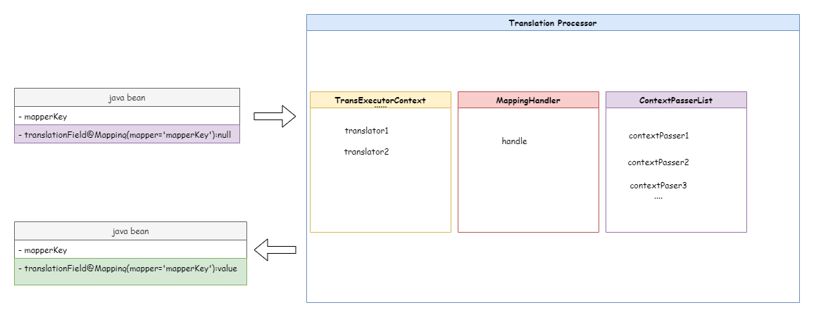

[English](./README-EN.md) | [中文](./README.md)

文档地址：https://kkkele.github.io/easy-translation/#

# Easy-Translation

一个配置上非常轻量，使用简单且强大而灵活的**字段翻译**插件。可以理解为**字段自动填充框架**，主要作用就是由其他的字段**自动映射**成所需要的字段。



## 作用场景

任何您想得到，需要值填充，而填充的手段希望简单，优雅的场景，都可以使用`Easy-Translation`。

## 开发背景

在web开发的过程中，后端程序员经常面临多表查询，然后组装成一个vo类的情况。于是，`Easy-Translation`应运而生，因为它使用场景灵活，所以不再局限于web开发，任何需要灵活，动态的值填充场景，都可以使用`Easy-Translation`，它帮助你省略大部分重复的代码，极大的提高了开发效率，而且从某一层面起到了解耦的作用，使得代码的职责更加清晰。

## 您能从哪里获得值填充（如何获取翻译器进行翻译）

- **动态方法**

  动态方法由对象执行，这就意味着，你可以原原本本的使用代理对象，所有增强方法的手段都会被得到执行，事务(例如:*@Transcational*)，缓存（例如:*@Cacheable*），或是幂等（`Easy-Idempotent`提供的**@Idempotent**）注解等等，具有极高的兼容性。

- **静态方法**

  静态方法并不需要执行对象，只要您提供的路径，能扫到该包，就可以成功的执行对应的翻译功能。

- **枚举类**

  是的，`Easy-Translation`支持您使用枚举当作翻译器，不过需要您在枚举类上额外标注*@TransMapper*注解当作翻译的key，*@TransValue*当作翻译的值，

  插件会自动为您生成一个方法（底层用map进行了一个存储），从而执行对应的翻译功能。

## 插件的灵活性

- 支持**多参数**翻译：（支持到*0*到*16*个参数。如果您希望由多于16中参数的方法作为翻译器，作者觉得，您可能需要更换代码的写法）

  详情用法请看文档

- 可**自选**翻译器返回结果的任意属性填充：

  是的，如果您标记了getUserById 方法为翻译器，当翻译器执行后，你可以选择user对象的任意属性进行填充

- **复用**翻译器翻译结果，减少执行方法的消耗：

  如果您需要翻译的字段是同一个翻译器，同一个映射值的执行后的不同属性，那么，插件不会 多次执行，而是会复用结果，以减少时间的消耗。

  例如：你需要在一个vo中填充user的age和name，那么您只需要在@Mapping注解的receive属性进行一个区分即可。

- **自定义翻译顺序**

  例如，您需要的返回对象某些的属性，有一些关联关系，先有a得到b，再用b得到c，你可以通过@Mapping的sort属性和after属性进行一个翻译器执行顺序的排序。

- **异步**组装翻译结果

  不相关的属性当然可以利用异步组装来减少时间消耗。

- 多线程异步组装**自动传递上下文变量**

  你可以注册一些上下文变量传递者，来解决异步时上下文变量丢失的问题。

- **自动解包**：如果您的返回对象是list，array，map或是其他您希望进行一个拆除的对象。那么插件会进行一个拆包操作，获取其中的item进行逐个翻译，当然，这个过程仍然可以异步处理

- **可扩展性极强**，具体请看相关文档

  可自定义 翻译器的生产过程，翻译器产生时的前置操作和后置操作

  可自定义 拆包者，选择拆包的结果，需要拆包的对象

- **开箱即用**

  在spring环境下，在启动类或是其他@component等注解上标记`@EnableTranslation`，即可使用

  在非spring环境下，需要自行手动创建一些全局对象进行维护

## 快速开始

pom.xml添加依赖

```java
        <dependency>
            <groupId>io.github.kkkele</groupId>
            <artifactId>easy-translation-spring-boot-start</artifactId>
            <version>1.0.0</version> //请自行替换为最新版本
        </dependency>
```

启动类或其他任意被spring管理的类上，加上@EnableTranslation注解

```java
@SpringBootApplication
@EnableTranslation //可自由选择扫描包的路径
public class EasyTranslationApplication {
    public static void main(String[] args) {
        SpringApplication.run(EasyTranslationApplication.class, args);
    }
}
```

在方法上打上**@Translator**注解，并自定义该注解的名称

```java
@Data
public class SysUser {

    private Integer userId;

    private String username;

    private String nickName;
}


@Service
public class UserServiceImpl implements UserService {

    @Override
    @Translator("getUser")
    public SysUser getById(Integer id) {
        try {
            Thread.sleep(1);
        } catch (InterruptedException e) {
            throw new RuntimeException(e);
        }
        SysUser sysUser = new SysUser();
        sysUser.setUserId(id);
        sysUser.setUsername("username" + id);
        sysUser.setNickName("nickName" + id);
        return sysUser;
    }
}

```

在需要翻译的类的字段上，使用@Mapping注解，指定翻译器，和所接收的属性名

```java
@Data
public class Product {

    private Integer productId;

    private String productName;

    private Integer catId;

    private Integer createBy;
}


@Data
public class ProductVo extends Product {

    @Mapping(translator = "getUser", mapper = "createBy",receive = "nickName")
    private String nickName;

    @Mapping(translator = "getUser", mapper = "createBy", receive = "username")
    private String username;

}
```

在需要翻译的方法上使用**@TranslationExecute**注解，即可自动对执行结果进行翻译填充，不论是map，还是数组，还是list，或是您有其他需求，都可以进行拆包填充

```java
    @Override
    @TranslationExecute
    public ProductVo getDetailById(Integer id) {
        ProductVo productVO = new ProductVo();
        Product byId = getById(id);
        BeanUtil.copyProperties(byId, productVO);
        return productVO;
    }
```

```javascript
@Data
public class R<T> {

    int code;

    T data;

    public R(int code, T data) {
        this.code = code;
        this.data = data;
    }

    public static <T> R<T> ok(T data) {
        return new R<>(200, data);
    }

    public static <T> R<T> error(T data) {
        return new R<>(500, data);
    }

    public static <T> R<T> error() {
        return new R<>(500, null);
    }

    public static <T> R<T> ok() {
        return new R<>(200, null);
    }
}    

```

```java
    @GetMapping("/{id}")
    @TranslationExecute(field = "data")
    public R<ProductVo> getDetailById(@PathVariable Integer id) {
        return R.ok(productService.getDetailById(id));
    }

    @GetMapping("/list")
    @TranslationExecute(field = "data")
    public R<List<ProductVo>> getList() {
        return R.ok(mappingToList(ListUtil.of(1, 2, 3, 4, 4)));
    }

    @GetMapping("/array")
    @TranslationExecute(field = "data")
    public R<ProductVo[]> getArray() {
        return R.ok(mappingToArray(1, 2, 3, 4, 5));
    }

    @GetMapping("/map")
    @TranslationExecute(field = "data")
    public R<Map<Integer, ProductVo>> getMap() {
        return R.ok(mappingToMap(1, 2, 3, 4, 5));
    }
```

以上就是一个springBoot环境下的一个简单示例

## 作者联系方式

有问题欢迎提出issue，或是联系本人探讨


