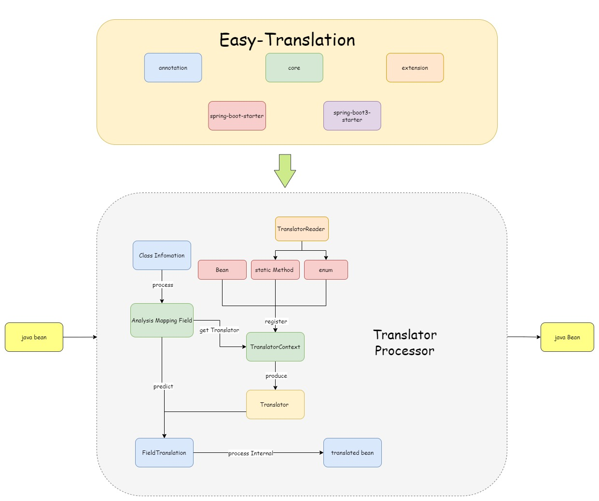

# Plugin introduction

[Easy - Translation](https://github.com/kkkele/easy-translation) is a ` Java ` automatic filling and plug-in object properties. Switch can be manually controlled, plug and play. No need for redundant configuration, in order to simplify development, improve efficiency, improve code reuse rate, reduce coupling degree.

## Feature

---

- **Low loss:** The translation function is implemented by the object directly calling the method, rather than reflecting the call, and the performance loss is small.
- **Flexibility:** can customize the order of field translation, and support  asynchronous translation (you can freely control the execution of synchronous translation or asynchronous translation after multiple asynchronous translations), support any attribute mapping translation in the class, support any attribute filling of the object obtained after translation. The context passer can be customized to ensure that multithreading does not lose context information.
- **Simple operation:** Supports full annotation operation without any complex steps. Comment properties are simple to understand.
- **Type of built-in translator :** Built-in 0 parameter context translator, 1 parameter mapping translation processor, 2 parameter conditional translator.
- **Strong scalability:** Full component design, developers are not satisfied with the replacement of components at any time. And can be customized to insert a number of plug-ins, to achieve different parameters of the translator, to achieve a variety of functions such as context passers.
- **Support personalization:** can customize thread pool, type unpack processor, default translator name generation, translation execution timeout and other personalized Settings.
- **Out of the box:** Support ecological powerful SpringBoot, just one comment, you can use.

## Plugin structure

---

## Code hosting

---

> [Gitee](https://gitee.com/cai-zhiyuDaKeLe/easy-translation) | [Github](https://github.com/kkkele/easy-translation)

## Video explanation

> Not yet available
