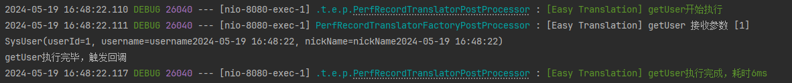

# Translation Callback

> This page shows how to use SpringBoot in a non-SpringBoot environment, please see other documentation

If the developer wants to call a callback method after the translator has finished executing, process the translation again or do some other action such as logging.

You can introduce this plugin.

## Maven

**[Important]** If the developer uses easy-translation-spring-boot-starter or easy-translation-spring-boot3-starter, there is no need to introduce it because the dependencies are already inherited.

```xml
<dependency>
    <groupId>io.github.kkkele</groupId>
    <artifactId>easy-translation-execute-callback</artifactId>
    <version>${last.version}</version> <!--请自行替换为最新版本-->
</dependency>
```

## gradle

**[Important]** If the developer uses easy-translation-spring-boot-starter or easy-translation-spring-boot3-starter, there is no need to introduce it because the dependencies are already inherited.

```gradle
implementation group: 'io.github.kkkele', name: 'easy-translation-execute-callback', version: ${last.version}
```

## CallbackRegister

```java
public interface CallBackRegister<T> {

    /**
     * 匹配翻译器名称，当匹配到时，为该翻译器执行增加回调
     *
     * @return 正则表达式
     */
    String match();

    TranslateExecuteCallBack<T> callBack();

    default int sort(){
        return 0;
    }
}

```

```java
@FunctionalInterface
public interface TranslateExecuteCallBack<T> {

    void onSuccess(T result);
}
```

Developers need to implement the CallbackRegister interface and let the Spring container manage it.

The CallbackRegister's callBack requires the developer to implement a callback method to process the translated result.

CallbackRegister's match requires the developer to provide a regular expression, and the translator matching the regular expression will add the callback method during the creation phase.

For example

```java
@Configuration
public class CallbackConfig {


    @Bean
    public CallBackRegister printerResCallbackRegister() {
        return new CallBackRegister() {
            @Override
            public String match() {
                return ".*";
            }

            @Override
            public TranslateExecuteCallBack callBack() {
                return res -> System.out.println(res);
            }
        };
    }

    @Bean
    public CallBackRegister callbackRegister() {
        return new CallBackRegister() {
            @Override
            public String match() {
                return "getUser";
            }

            @Override
            public TranslateExecuteCallBack callBack() {
                return res ->
                        System.out.println("getUser执行完毕，触发回调");
            }
        };
    }
}

```

In the class, added two CallbackRegister Bean, first printerResCallbackRegister will effect on all of the registry.

The second Bean works only on the getUser registry.

## Effect


