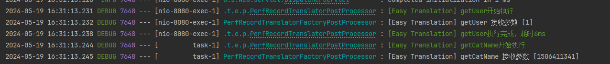

# Performance Recorder

> This document describes how to use the SpringBoot environment. In a non-SpringBoot environment, manual configuration is required
>
> Developers may encounter an error indicating that the slf4j implementation class cannot be found. Please resolve the problem yourself

## application.yml

```yml
easy-translation:
  debug: true
logging:
  level:
    com.superkele.translation: debug

```

## maven

```xml
        <dependency>
            <groupId>io.github.kkkele</groupId>
            <artifactId>easy-translation-perf-record</artifactId>
            <version>${last.version}</version> <!--最小版本为1.2.0-->
        </dependency>
```

## gradle

```gradle
implementation group: 'io.github.kkkele', name: 'easy-translation-perf-record', version: ${last.version}  <!--最小版本为1.2.0-->
```


## Effect

```console
2024-05-19 16:28:28.919 DEBUG 22208 --- [nio-8080-exec-1] .t.e.p.PerfRecordTranslatorPostProcessor : [Easy Translation] getUser执行完成，耗时5ms
2024-05-19 16:28:28.924 DEBUG 22208 --- [         task-1] .t.e.p.PerfRecordTranslatorPostProcessor : [Easy Translation] getCatName开始执行
2024-05-19 16:28:28.924 DEBUG 22208 --- [         task-1] PerfRecordTranslatorFactoryPostProcessor : [Easy Translation] getCatName 接收参数 [-556595081]
```

