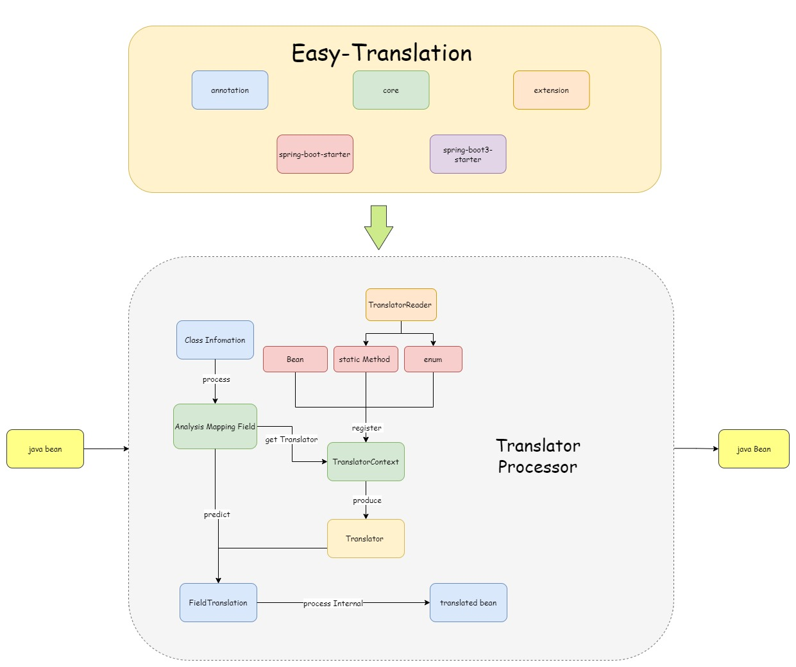

# 插件介绍

[Easy-Translation](https://github.com/kkkele/easy-translation)是一款 `java` 对象属性自动填充插件。可手动控制开关，即插即用。无需多余配置，为简化开发，提升效率，提高代码复用率，降低耦合度而生。

## 特性

---

- **损耗小：**翻译功能由对象直接调用方法实现，而非反射调用，性能损耗小。
- **灵活性强：**可*自定义*编排字段翻译的顺序，且支持*异步*翻译（可以自由控制在多个异步翻译后执行同步翻译或异步翻译），支持类中任意属性映射翻译，支持由翻译后得到对象的任意属性填充。且可自定义实现上下文传递器，保证多线程不丢失上下文信息。
- **操作简单：**支持全注解操作，无任何复杂步骤。注解属性简单易懂。
- **内置翻译器种类**：内置0参上下文翻译器，1参映射翻译处理器，2参条件翻译器。
- **扩展性强：**采用全组件设计，开发者不满意可随时替换组件。且可自定义插入多个插件，实现不同参数的翻译器，实现上下文传递器等多种功能。
- **支持个性化：**可自定义线程池，类型解包处理器，默认翻译器名称生成，翻译执行超时时间等多种个性化设置。
- **开箱即用：**支持生态强大的SpringBoot，只需一个注解，即可使用。

## 插件结构

---

## 代码托管

---

> [Gitee](https://gitee.com/cai-zhiyuDaKeLe/easy-translation) | [Github](https://github.com/kkkele/easy-translation)

## 视频讲解

> 暂未出炉

