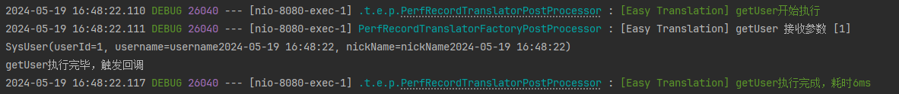

# 翻译器回调执行

> 本页面展示的为SpringBoot环境下是如何使用的，在非SpringBoot请看其他文档

如果开发者希望在翻译器执行完后，调用一个回调方法，再次处理翻译结果或者是做其他诸如日志之类的动作。

你可以引入该插件。

## Maven

**【重要】**如果开发者使用了easy-translation-spring-boot-starter或者easy-translation-spring-boot3-starter，则无需引入，因为已经继承了相关依赖。

```xml
<dependency>
    <groupId>io.github.kkkele</groupId>
    <artifactId>easy-translation-execute-callback</artifactId>
    <version>1.2.0</version> <!--请自行替换为最新版本-->
</dependency>
```

## gradle

**【重要】**如果开发者使用了easy-translation-spring-boot-starter或者easy-translation-spring-boot3-starter，则无需引入，因为已经继承了相关依赖。

```gradle
implementation group: 'io.github.kkkele', name: 'easy-translation-execute-callback', version: '1.2.0'
```

## CallbackRegister

```java
public interface CallBackRegister<T> {

    /**
     * 匹配翻译器名称，当匹配到时，为该翻译器执行增加回调
     *
     * @return 正则表达式
     */
    String match();

    TranslateExecuteCallBack<T> callBack();

    default int sort(){
        return 0;
    }
}

```

```java
@FunctionalInterface
public interface TranslateExecuteCallBack<T> {

    void onSuccess(T result);
}
```

开发者需要实现CallbackRegister接口，并交由Spring容器管理。

CallbackRegister的callBack需要开发者实现一个回调方法，对翻译的结果进行处理。

而CallbackRegister的match需要开发者提供一个正则表达式，匹配该正则表达式的翻译器将会在创建阶段添加该回调方法。

举个例子

```java
@Configuration
public class CallbackConfig {


    @Bean
    public CallBackRegister printerResCallbackRegister() {
        return new CallBackRegister() {
            @Override
            public String match() {
                return ".*";
            }

            @Override
            public TranslateExecuteCallBack callBack() {
                return res -> System.out.println(res);
            }
        };
    }

    @Bean
    public CallBackRegister callbackRegister() {
        return new CallBackRegister() {
            @Override
            public String match() {
                return "getUser";
            }

            @Override
            public TranslateExecuteCallBack callBack() {
                return res ->
                        System.out.println("getUser执行完毕，触发回调");
            }
        };
    }
}

```

在类中，添加了两个CallbackRegister Bean，第一个printerResCallbackRegister将会作用在所有的注册器上。

而第二个Bean只会作用在getUser注册器上。

## 效果


