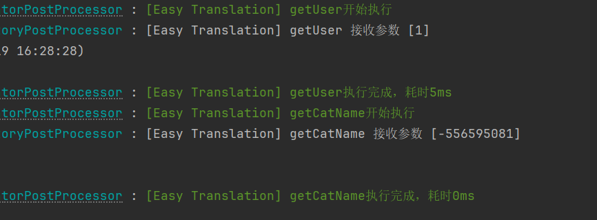

# 性能分析器

> 本文主要讲解SpringBoot环境下如何使用，非SpringBoot环境需要额外进行手动配置
>
> 开发者可能会遇到无法找到slf4j实现类的报错，请自行解决相关问题

## 首先在application.yml中配置

```yml
easy-translation:
  debug: true
logging:
  level:
    com.superkele.translation: debug

```

## maven中引入依赖

```xml
        <dependency>
            <groupId>io.github.kkkele</groupId>
            <artifactId>easy-translation-perf-record</artifactId>
            <version>${last.version}</version> <!--最小版本为1.2.0-->
        </dependency>
```

### 效果

